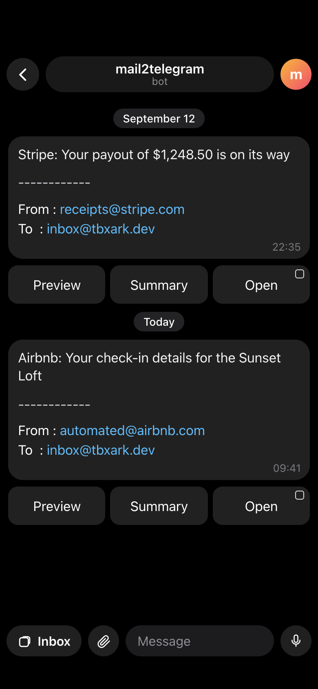

<h1 align="center">
mail2telegram
</h1>

<p align="center">
    <br> <a href="../README.md">English</a> | 中文
</p>
<p align="center">
    <em>在 Telegram 中收邮件：即时推送通知 + Mini App 收件箱。</em>
</p>


**mail2telegram** 是一个基于 Cloudflare Email Routing 的 Workers 项目。收到的邮件会被解析、带上快捷操作按钮推送到 Telegram，并完整保存下来，你可以在 Telegram Mini App 中浏览全部历史记录。白名单、黑名单以及所有运行参数都在 Mini App 中管理。

前端是基于 React 的 Mini App，使用 [Konsta UI](https://konstaui.com) 实现 iOS / iPadOS 风格，并接入 Telegram Mini Apps 原生控件。邮件历史与设置存放在 **Cloudflare D1**，附件和超大正文存放在 **R2**。

<details>
<summary>点击查看 Demo</summary>

</details>

## 工作原理

```
Email Routing ──▶ Worker email() ──▶ 解析 ──▶ D1（邮件 + 设置）──▶ Telegram 推送
                                              └─▶ R2（附件、大正文）

Telegram Mini App ──▶ Worker fetch() ──▶ /api/*（校验 initData）──▶ D1 / R2
```

- **推送通知**为每封邮件提供快捷按钮：`Preview`、`Summary`、`Open`。
- **Mini App 收件箱**按文件夹浏览历史、沙箱渲染 HTML、下载附件、通过 Resend 回信，并管理全部设置。
- **Mini App 设置**包含支持正则匹配的白/黑名单、地址测试、阻断策略、转发、AI 摘要选项和邮件处理限制。

## 安装

### 0. 配置 Telegram

1. 创建机器人获取 Token，使用 `@BotFather > /newbot`，创建机器人并复制 Token。
2. 使用 Telegram Mini App 必须设置隐私政策。访问 `@BotFather > /mybots > (选择你的机器人) > Edit Bot > Edit Privacy Policy`，设置为 Telegram Mini Apps 默认隐私政策：`https://telegram.org/privacy-tpa`。
3. 部署完成后，访问 `https://project_name.user_name.workers.dev/init` 绑定 Webhook 并注册命令。

### 1. 创建存储

创建 D1 数据库，如需附件再创建 R2 存储桶。可以用 Wrangler 或 Cloudflare 控制台：

```bash
npx wrangler d1 create mail2telegram
npx wrangler r2 bucket create mail2telegram
```

记下数据库 id，下一步部署会用到。

### 2. 使用 Cloudflare Workers Builds 部署（推荐）

本项目参考 [Sink](https://docs.sink.cool/zh-CN/deployment/workers) 的做法：生产环境资源 id 通过 **build variables** 注入，因此不会出现在仓库中的 `wrangler.jsonc` 里。

1. Fork 或推送本仓库到 GitHub。
2. 在 Cloudflare 控制台进入 **Workers & Pages → Create → Workers → Connect to Git**，选择该仓库。
3. 设置构建命令与部署命令：
   - **Build command**: `pnpm build`
   - **Deploy command**: `pnpm deploy`
4. 添加以下 **build variables**：

   | Build variable                  | 必填 | 说明                                       |
   |:--------------------------------|:-----|:-------------------------------------------|
   | `DEPLOY_D1_DATABASE_ID`         | 是   | `wrangler d1 create` 得到的 D1 数据库 id。 |
   | `DEPLOY_D1_DATABASE_NAME`       | 否   | D1 数据库名，默认 `mail2telegram`。        |
   | `DEPLOY_R2_BUCKET_NAME`         | 否   | 存放附件的 R2 存储桶，省略则不启用附件。   |
   | `DEPLOY_R2_PREVIEW_BUCKET_NAME` | 否   | 预览部署使用的 R2 存储桶。                 |

`pnpm deploy` 会执行 `scripts/build-config.mjs`、应用 D1 迁移，并用生成的（已 gitignore）`wrangler.deploy.jsonc` 部署。

5. 在 **Settings → Variables and Secrets** 中添加下方运行参数与密钥。密钥（`TELEGRAM_TOKEN`、`RESEND_API_KEY`、`OPENAI_API_KEY`）请放入加密的 Secrets 区域。

### 3. 手动部署（备选）

```bash
git clone git@github.com:TBXark/mail2telegram.git
cd mail2telegram
pnpm install
cp wrangler.example.jsonc wrangler.jsonc   # 填写 bindings 与变量
pnpm db:migrate:remote                     # 或：npx wrangler d1 migrations apply DB --remote
pnpm build && npx wrangler deploy
```

### 4. 配置 Cloudflare Email Routing

1. 参考官方教程配置 [Cloudflare Email Routing](https://blog.cloudflare.com/introducing-email-routing/)。
2. 在 `Email Routing → Routing Rules` 中，将 `Catch-all address` 的动作改为 `Send to a Worker: mail2telegram`。
3. 如需备份邮件，把你的地址加入 `FORWARD_LIST`。该地址需要在 `Email Routing → Destination addresses` 中完成验证。

## 配置

位置：Workers & Pages → 你的 worker → Settings → Variables and Secrets。

| KEY                       | 说明                                                                                                                                              |
|:--------------------------|:--------------------------------------------------------------------------------------------------------------------------------------------------|
| `TELEGRAM_ID`             | 推送目标 Chat ID，多个用英文逗号分隔。可用机器人 `/id` 命令获取，群组以 `-100` 开头。                                                             |
| `TELEGRAM_TOKEN`          | Telegram Bot Token，例如 `7123456780:AAjkLAbvSgDdfsDdfsaSK0`。                                                                                    |
| `DOMAIN`                  | Worker 域名，例如 `project_name.user_name.workers.dev`，用于 Webhook 与 Mini App 链接。                                                           |
| `FORWARD_LIST`            | 可选的备份地址，逗号分隔，同时作为 Mini App 中转发设置的初始值。                                                                                   |
| `BLOCK_POLICY`            | `reject,forward,telegram` 的逗号子集。`reject` 拒收，`forward` 跳过备份转发，`telegram` 跳过 Telegram 推送。默认 `telegram`。可在 Mini App 修改。 |
| `MAIL_TTL`                | 邮件保留时间（秒），默认一天。可在 Mini App 修改。                                                                                                |
| `MAX_EMAIL_SIZE`          | 触发 `MAX_EMAIL_SIZE_POLICY` 的邮件大小上限（字节），默认 `524288`。                                                                              |
| `MAX_EMAIL_SIZE_POLICY`   | `unhandled`、`truncate`、`continue` 之一，默认 `truncate`。                                                                                       |
| `WORKERS_AI_MODEL`        | Workers AI 模型 id。绑定 `AI` 且设置该值后，摘要使用 Workers AI。                                                                                 |
| `OPENAI_API_KEY`          | 未配置 Workers AI 时，通过 OpenAI 兼容接口生成摘要。                                                                                              |
| `OPENAI_COMPLETIONS_API`  | 自定义 chat completions 地址，默认 `https://api.openai.com/v1/chat/completions`。                                                                 |
| `OPENAI_CHAT_MODEL`       | 自定义模型名，默认 `gpt-4o-mini`。                                                                                                                |
| `SUMMARY_TARGET_LANG`     | 摘要语言，默认 `english`。                                                                                                                        |
| `GUARDIAN_MODE`           | 对相同 `Message-ID` 跳过重复通知，默认关闭。                                                                                                      |
| `RESEND_API_KEY`          | Resend API Key，https://resend.com/docs/introduction。启用后可在 Telegram 或 Mini App 中回信。                                                    |
| `WHITE_LIST` / `BLOCK_LIST` | 可选的 JSON 数组，元素为精确地址或正则。作为 Mini App 名单的初始值，建议直接在 Mini App 中维护。                                                  |
| `DEBUG`                   | 为 `true` 时推送会增加 `Debug` 按钮。                                                                                                             |

Bindings：

| Binding  | 类型        | 说明                                      |
|:---------|:------------|:------------------------------------------|
| `DB`     | D1 Database | 邮件历史、地址名单、设置、Telegram 映射。 |
| `BUCKET` | R2 Bucket   | 附件与超大正文，可选。                    |
| `AI`     | Workers AI  | 可选，用于摘要。                          |

## Telegram Mini App

在机器人中通过 `/start` 打开 Mini App，或用 `/white`、`/block` 直接跳转到对应板块。以下内容全部在 Mini App 中管理：

- **收件箱** — 文件夹（Inbox / Spam / Trash / Sent）、搜索、未读与星标筛选，通过 “Load more” 加载更多历史。
- **阅读页** — 沙箱 HTML 视图与纯文本切换、附件、星标/已读/删除、AI 摘要与回复。
- **设置** — 白名单、黑名单、地址测试、阻断策略、转发、摘要选项以及邮件处理限制。

Mini App 使用 `TELEGRAM_TOKEN` 校验 Telegram `initData`，并限制为 `TELEGRAM_ID` 中的用户，无法作为普通网页打开。

手机端使用原生底部标签栏与导航栈；桌面端（macOS、Telegram Desktop）与宽屏会自动切换为 iPad 风格的侧栏 + 列表 + 阅读窗格三栏布局。

## 使用

推送消息结构保持不变：

```
[Subject]

-----------
From : [sender]
To   : [recipient]

(Preview)(Summary)(Open)
```

1. `Preview` 直接在聊天中显示纯文本正文，最多 4096 字符。
2. 配置 Workers AI 或 OpenAI Key 后可用 `Summary`。
3. `Open` 直接打开 Mini App 中该邮件的详情页。Telegram 只允许在私聊中使用 Mini App 按钮，因此群组推送会省略该按钮。

在 Telegram 中回复任意推送消息即可通过 Resend 给发件人回信。

### 地址名单

规则存放在 D1，可在 Mini App 中录入。规则匹配精确地址（不区分大小写）或正则表达式。白名单优先于黑名单，因此一条白名单规则可以覆盖同一地址的宽泛黑名单规则。

### 附件

附件存放在 R2，并在阅读页中列出、可下载。未配置 `BUCKET` 时，邮件仍会保存，只是不包含附件内容。

### 保留策略

超过 `MAIL_TTL` 的邮件不再作为通知缓存，但 D1 中的历史会保留，直到你在 Mini App 中删除。

## 开发

```bash
pnpm install
pnpm dev            # Vite 开发服务器 :5173 + wrangler dev :8787
pnpm build          # 类型检查并构建 Mini App 到 dist/client
pnpm test           # parseEmail 单元测试
pnpm lint           # eslint --fix
```

本地 D1 迁移：

```bash
pnpm db:migrate:local
```

Mini App 正常需要有效的 Telegram `initData` 签名。本地开发时，在 `.dev.vars` 中加入 `DEV_BYPASS_AUTH=true` 再运行 `wrangler dev`，然后打开 `http://localhost:5173/?debug`。加 `?platform=ios` 可在桌面浏览器中预览手机端布局。切勿在部署的 worker 中设置 `DEV_BYPASS_AUTH`。

## License

**mail2telegram** 基于 MIT 协议发布，详见 [LICENSE](LICENSE)。
